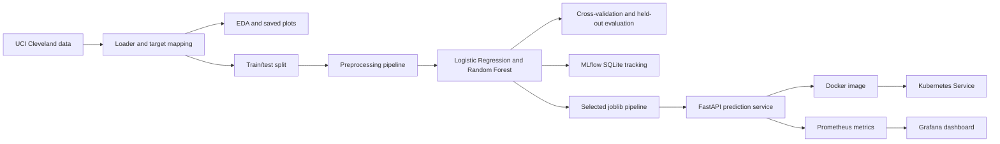

# MLOps Assignment 01: Heart Disease Risk Classification

**Course:** Machine Learning Operations (MLOps) AIMLCZG523  
**Student:** [Add your name and ID]  
**Date:** [Add submission date]

> This project is an educational classification exercise. It is not a diagnostic or treatment system and must not be used for clinical decisions.

## 1. Objective and scope

This project implements a reproducible local workflow for binary heart-disease classification: source-data inspection, preprocessing, two-model comparison, experiment tracking, model packaging, a prediction API, tests, container configuration, and local deployment configuration. No GitHub account or remote repository is used.

## 2. Data source and target definition

The source is the processed Cleveland subset of the Heart Disease dataset from the [UCI Machine Learning Repository](https://archive.ics.uci.edu/dataset/45/heart+disease), specifically `data/heart+disease/processed.cleveland.data`. The accompanying `heart-disease.names` describes 303 observations and 14 columns: 13 features and the original diagnosis `num`.

The source diagnosis is an ordinal value from 0 to 4. Following the dataset documentation's common experimental setup, this work maps `num=0` to no disease (`target=0`) and `num=1,2,3,4` to disease present (`target=1`). The feature names used are age, sex, cp, trestbps, chol, fbs, restecg, thalach, exang, oldpeak, slope, ca, and thal. The dataset metadata identifies the collection investigators as Andras Janosi, William Steinbrunn, Matthias Pfisterer, and Robert Detrano; attribution details are included in the original metadata file.

## 3. Data inspection and EDA

The input file is headerless and uses commas. The loader assigns the documented column names and treats `?` as missing. The inspected data has 303 rows, 13 model features, no duplicate rows, and six missing feature values: four in `ca` and two in `thal`. The binary class counts are 164 no-disease cases (54.13%) and 139 disease-present cases (45.87%).

The EDA script writes `artifacts/eda_summary.json`, `artifacts/class_balance.png`, `artifacts/feature_distributions.png`, and `artifacts/correlation_heatmap.png`. The histograms compare five continuous measurements by target class. The correlation plot includes those continuous measurements only; the other inputs are numeric codes for categories, and treating the codes as continuous measurements could imply misleading distances between category values.

**Observed EDA notes:** [Add your own interpretation after reviewing the generated figures. Avoid claims of causation.]

## 4. Preprocessing and feature engineering

All transformations are part of the scikit-learn model pipeline to keep training and inference consistent and prevent preprocessing leakage across validation folds. The continuous features age, trestbps, chol, thalach, and oldpeak use median imputation and standard scaling. The coded categories sex, cp, fbs, restecg, exang, slope, ca, and thal use most-frequent imputation and one-hot encoding. `OneHotEncoder(handle_unknown="ignore")` allows inference to proceed when an unseen category is encountered.

## 5. Model development and evaluation

The data is split into a stratified 80% training portion and 20% held-out test portion using random seed 42. Hyperparameters are selected within the training portion by three-fold stratified GridSearchCV scored on ROC-AUC. The selected configurations are then compared with five-fold stratified cross-validation on the training portion. The final tuned estimator is evaluated on the held-out test portion. The test data is not used for parameter selection.

| Model | Best parameters | CV accuracy | CV precision | CV recall | CV ROC-AUC | Test accuracy | Test precision | Test recall | Test ROC-AUC |
|---|---|---:|---:|---:|---:|---:|---:|---:|---:|
| Logistic Regression | `C=0.1` | 0.839 | 0.868 | 0.774 | 0.902 | 0.885 | 0.839 | 0.929 | 0.965 |
| Random Forest | `n_estimators=250`, `max_depth=None`, `min_samples_leaf=3` | 0.814 | 0.800 | 0.801 | 0.899 | 0.869 | 0.813 | 0.929 | 0.951 |

The final selection is Logistic Regression because it had the higher mean five-fold training ROC-AUC (0.902 vs 0.899). The held-out test metrics are reported once for the selected split. Recall is included because false negatives are relevant to risk screening, but neither the metric nor the model establishes clinical utility. With only 303 historical records, estimates are uncertain and may not generalize to other populations or current practice.

Comparison metrics are saved in `artifacts/model_comparison.csv`. Confusion matrices and ROC plots are saved in `artifacts/evaluation/`.

## 6. Experiment tracking and packaged model

Training logs one MLflow run per classifier to the local SQLite store `mlflow.db`. Runs record model choice, tuning parameters, cross-validation metrics, held-out metrics, the evaluation plots, EDA artifacts, and a joblib model artifact. The selected complete pipeline is saved to `models/heart_disease_pipeline.joblib`; its selection rationale and feature contract are recorded in `models/model_metadata.json`.

To inspect the local runs:

```powershell
mlflow ui --backend-store-uri sqlite:///mlflow.db --host 127.0.0.1 --port 5000
```

## 7. API and tests

FastAPI exposes `GET /health`, `POST /predict`, and `GET /metrics`. `/predict` validates the 13 feature fields, rejects unknown fields, returns the binary class, predicted-class confidence, and disease probability. Nullable `ca` and `thal` values use the saved training imputers. API request logging records the prediction class but intentionally omits feature payloads because they represent sensitive health information.

Automated tests cover the actual UCI data contract and label conversion, preprocessing with missing values, saving and reloading the complete pipeline, valid and invalid API requests, behavior when the model is unavailable, health, and Prometheus metrics. Latest recorded test result: **8 passed**. Ruff linting: **passed**. (Rerun both at submission time and insert dated screenshots/logs.)

## 8. Architecture



## 9. Automation, containerization, and deployment status

`Jenkinsfile` defines local Windows pipeline stages for dependency installation, lint, tests, EDA, and training. `scripts/run_local_ci.ps1` provides the same checks without Jenkins. No GitHub account or hosted service is required. The Jenkins service itself still needs to be installed and a local-folder pipeline configured before claiming a Jenkins execution.

`Dockerfile` packages the API and trained model using runtime-only dependencies. `docker-compose.yml` configures the API, Prometheus, and a provisioned Grafana dashboard. Kubernetes manifests define a Deployment and LoadBalancer Service. These configuration files are prepared, but container image build, monitoring stack execution, and Kubernetes deployment still require a running Docker Desktop engine and local cluster.

**Evidence to insert:** [Add actual Docker build/run screenshots, Prometheus/Grafana screenshots, Jenkins output, and Kubernetes pod/service screenshots after running them. Do not label configuration as a successful deployment.]

## 10. Reproduction and remaining submission evidence

From PowerShell in the project directory:

```powershell
.\.venv\Scripts\Activate.ps1
python -m src.eda
python -m src.train
python -m ruff check src tests
python -m pytest -q
```

Then build and test the service:

```powershell
docker build -t heart-disease-api:local .
docker run --rm -p 8000:8000 heart-disease-api:local
```

For the monitoring stack, run `docker compose up --build`. For local Kubernetes, make the image available to the selected cluster and apply `deployment/deployment.yaml`.

Before submission, add the student's details, personal EDA interpretation, actual CI/container/deployment/monitoring evidence, and short end-to-end demonstration video. Export this report to PDF or DOCX and expand the discussion/screenshots to the required ten pages. Do not invent measurements or claim execution that has not occurred.
